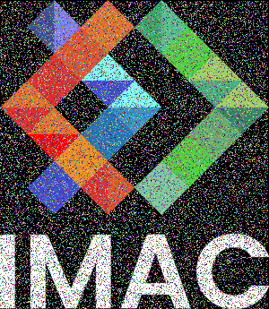
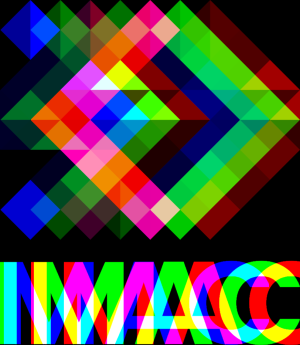
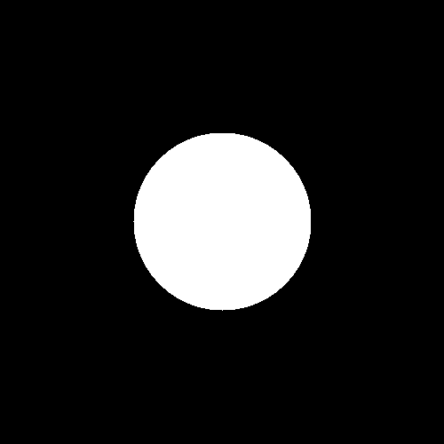
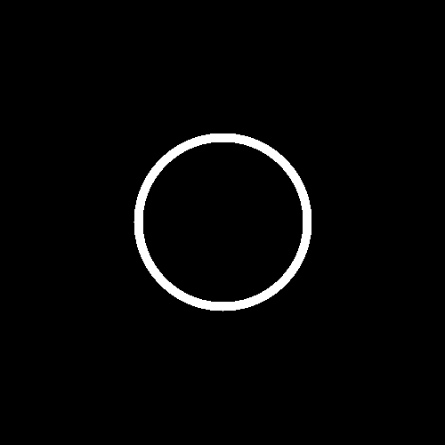
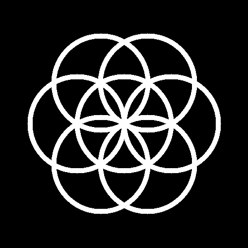
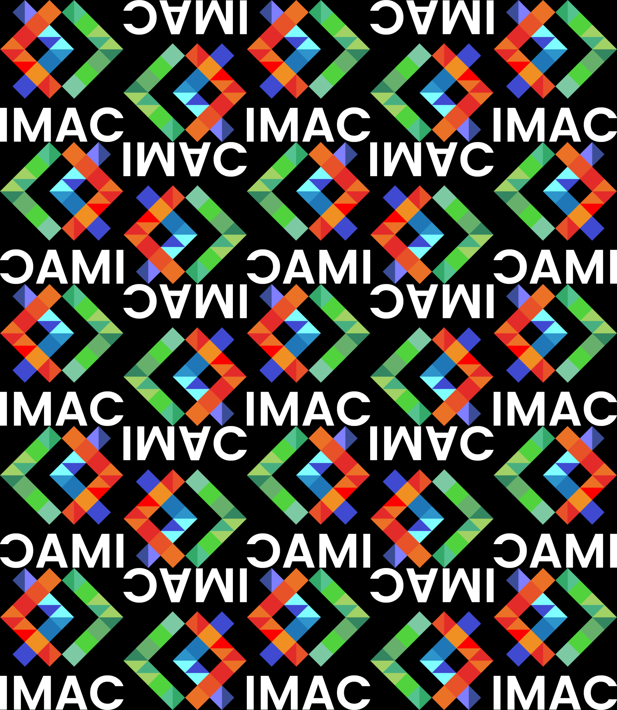
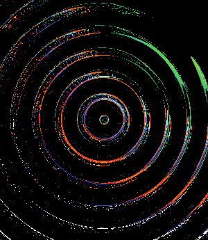
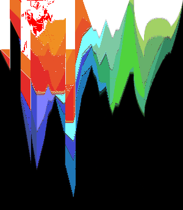

## Ne garder que le vert
| ||
| ------------- |-------------|

---
## Échanger les canaux
| ||
| ------------- |-------------|

---
## Noir & Blanc
| ||
| ------------- |-------------|

---
## Négatif
| ||
| ------------- |-------------|

---
## Dégradé


Le calcul a pris un peu de temps à être trouvé, mais c'est :
```cpp
float color = static_cast<float>(i) /(image.width()-1);
image.pixel(i, y) += color;
```
---

## Miroir
| ||
| ------------- |-------------|

Nous avons eu deux façons de faire :
```cpp
std::swap(image.pixel(i, y), image.pixel(image.width()-1-i, y));
```
Ou avec une fonction :
```cpp
int miroir = image.width()-x;
imageInverse.pixel(miroir, y) = image.pixel(x, y);
```
---


Autre effet "miroir" découvert avec ce code-ci :

```cpp
int miroir = image.width()-x;
glm::vec3 couleur = image.pixel(x, y);
image.pixel(miroir, y) = couleur;
```
---

## Image bruitée
| ||
| ------------- |-------------|

Pour cet effet, nous avons fait en sorte d'avoir des coordonnées de pixels `random`, et ensuite nous avons fait de même pour chaque partie de la couleur du pixel en question.

---
## Rotation 90°
| ||
| ------------- |-------------|

Nous avons créé une nouvelle image en inversant les valeurs de `width` et de `height`. Puis nous avons recopié l'image à partir des bonnes coordonnées.

---
## RGB Split
| ||
| ------------- |-------------|

On ne sait pas trop comment expliquer donc voici le code :
```cpp
sil::Image split{image.width(), image.height()};
    for(int i {0}; i<split.width(); i++){
        for(int j {0}; j<split.height(); j++){
            if(i<=30){
                split.pixel(i, j).g = image.pixel(i, j).g;
                split.pixel(i, j).b = image.pixel(i+30, j).b;
            }
            else if(i>=split.width()-31){
                split.pixel(i, j).r = image.pixel(i-30, j).r;
                split.pixel(i, j).g = image.pixel(i, j).g;
            }
            else {
                split.pixel(i, j).r = image.pixel(i-30, j).r;
                split.pixel(i, j).g = image.pixel(i, j).g;
                split.pixel(i, j).b = image.pixel(i+30, j).b;
            }
        }
    }
    split.save("output_l/rgb_split.png");
```

---
## Luminosité

|Image de référence |Après éclaircissement |Après assombrissement |
| ------------- |-------------| -----|
| | ||

Pour les deux nous avons utilisé la fonction `pow()`, avec différentes valeurs de puissance.

---
## Disque


Dans le `if` pour colorer les bons pixels, nous avons utilisé :
```cpp
std::pow(i - image.width()/2, 2) + std::pow(j - image.height()/2, 2) <= std::pow(100, 2);
```

---
## Cercle


Nous avons utilisé deux fois le même `if` que pour le disque, avec des valeurs différentes.

---
## Rosace


Nous avons recréé une fonction `dessine_cercle`, que l'on a appelé plusieurs fois, pour dessiner les différents cercles de la rosace.

```cpp
sil::Image dessine_cercle(sil::Image& photo, int center_x, int center_y){
    int thickness {10};
    for (int i {0}; i<photo.width(); i++){
        for (int j {0}; j<photo.height(); j++){
            float const distance_carre { static_cast<float>(std::pow(i - center_x, 2) + std::pow(j - center_y, 2))};
            if (distance_carre <= std::pow(100, 2)){
                if (distance_carre >= std::pow(100-thickness, 2)){
                    photo.pixel(i, j) = glm::vec3{1};
                }
            }
        }
    }
    return photo;
}
```

---
## Mosaïque
| ||
| ------------- |-------------|

Nous avons créé une image noir de 5 fois la taille de l'image originale.
Puis avec une fonction `copie_image`, que nous avons appelé 25 fois dans deux boucles `for`, nous copions l'image original dessus.

---
## Mosaïque miroir
|       |         |   |
| ------------- |-------------| -----|

Le début se passe de la même manière que la mosaïque normale. Cependant nous avons créé 3 autres images avec les fonction `al_envers` et `image_en_miroir`, afin de pouvoir ensuite les copier sur l'image finale.

La mosaïque intermédiaire obtenu était dû à l'inversion dans les boucles des codes `copie_image(image, logo_a_miroir, k, j);` et `copie_image(image, logo_a_l_envers, k, j);`. Ceci est plus visible dans le code.

---
## Glitch
| | |
| ------------- |-------------| -----|

Dû à des problèmes de coordonnées, nous avons obtenu le résultat intermédiaire ci-dessus, que nous avons nommé le "glitch fondant".

Pour le cas du glitch normal, nous avons demandé des coordonnées de rectangle avec `random_int()`, puis dans ces coordonnées, nous avons demandé des valeurs de couleur avec aussi `random_float()`. Nous avons limité le nombre de glitch dans une boucle à 100.

---
## Fractale de Mandelbrot


Nous avons fait une boucle `while`, dans laquelle nous vérifions pour chaque pixel le calcul de `std::abs(z)` et `z=z*z+c`.

```cpp
while(std::abs(z)<=2 && iter<maxIter){
    z = z*z + c;
    iter++;
    image.pixel(i, j) = glm::vec3(1.f);
}
```

Puis en fonction du résultat de `iter`, nous colorons les pixels en noir ou en blanc.
Pour qu'il ait un degré différent de gris, nous avons fait le calcul : `image.pixel(i, j) = glm::vec3(0.f + iter*0.02f);`.

---
## Vortex
| |
| ------------- |-------------|

---
## Tramage
| | |
| ------------- |-------------|

L'effet de tramage a été obtenu en adaptant le code trouvé sur [cet article](https://medium.com/the-bkpt/dithered-shading-tutorial-29f57d06ac39).

Ce qui donne :
```cpp
void Dithering(sil::Image& image)
{
    const int bayer_n = 4;
    float bayer_matrix_4x4[][bayer_n] = {
    {    -0.5,       0,  -0.375,   0.125 },
    {    0.25,   -0.25,   0.375, - 0.125 },
    { -0.3125,  0.1875, -0.4375,  0.0625 },
    {  0.4375, -0.0625,  0.3125, -0.1875 },
    };

    for (int y{0}; y < image.height(); y++) 
    {
        for (int x{0}; x < image.width(); x++) 
        {
            float orig_color = image.pixel(x, y).r;
            float color_result = 0.f;
            float bayer_value = bayer_matrix_4x4[y % bayer_n][x % bayer_n];
            float output_color = orig_color + (2 * bayer_value);

            if (output_color > 0.5) 
            {
                color_result = 1.f;
            }

            glm::vec3 Color(color_result);
            image.pixel(x, y) = Color;
        }
    }
}
```

---
## Normalisation de l'histogramme
| ||
| ------------- |-------------|

---
## Convolution
|Original | Avec des boucles|Final|
| ------------- |-------------|-------------|
| |  ||

Après plusieurs essais avec des boucles, nous avons fini par trouver le code.
Notre problème se trouvait dans le calcul de la couleur des pixels à l'intérieur des quatres boucles `for`.
```cpp
couleur += logo.pixel(coordx, coordy)*kernel[i+static_cast<int>(kernel.size())/2][j+static_cast<int>(kernel[0].size())/2];
```
`coordx` et `coordy` correspondent aux coordonées permettant d'accéder au bon pixel en fonction des coordonnées de la matrice `kernel`. Les calculs dans les coordonnées de `kernel`, sont fait afin d'éviter de sortir de la matrice et donc d'avoir un problème.

## Netteté, contours, etc.
|Emboss|Outline|Sharpen|
| ------------- |-------------|-------------|
| |  ||

La matrice `kernel` a juste vu ses valeurs changer en fonction de l'effet demandé.
Voici les différentes matrices :
```cpp
std::vector<std::vector<float>> matrix_emboss {
        {-2.f, -1.f, 0.f},
        {-1.f, 1.f, 1.f},
        {0.f, 1.f, 2.f}
    };
std::vector<std::vector<float>> matrix_outline {
        {-1.f, -1.f, -1.f},
        {-1.f, 8.f, -1.f},
        {-1.f, -1.f, -1.f}
    };
std::vector<std::vector<float>> matrix_sharpen {
        {0.f, -1.f, 0.f},
        {-1.f, 5.f, -1.f},
        {0.f, -1.f, 0.f}
    };
```

---
## Tri de pixels
| ||
| ------------- |-------------|