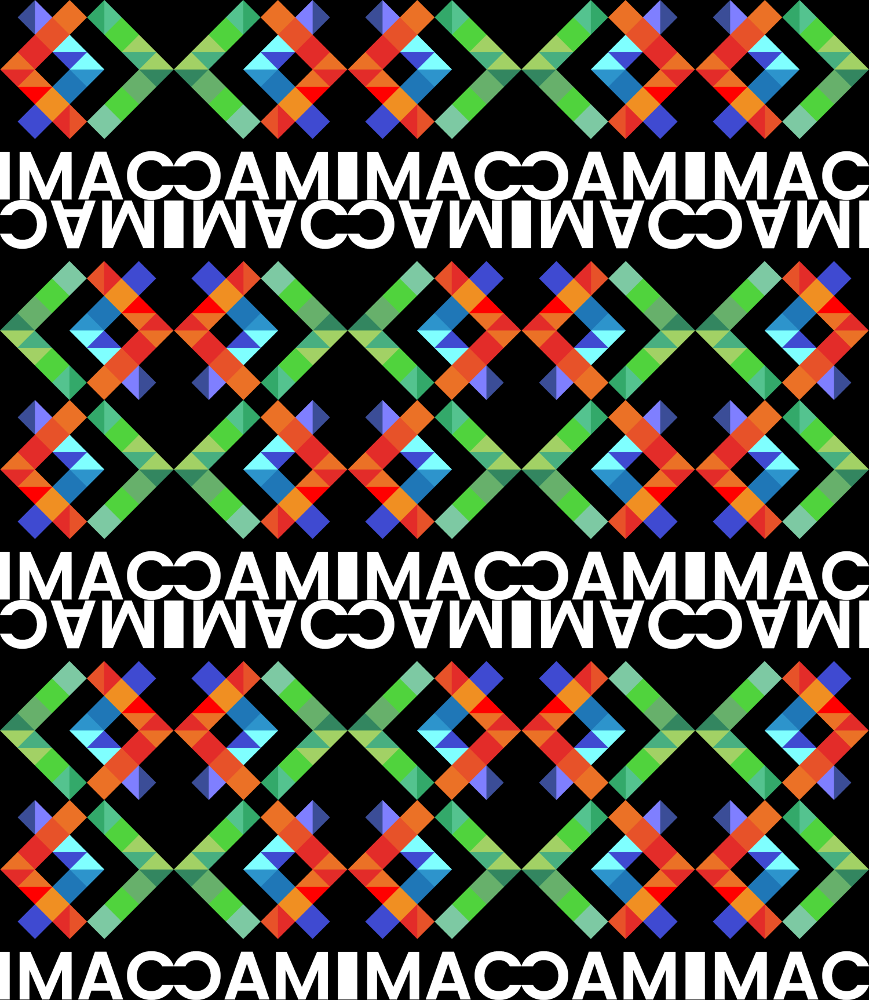
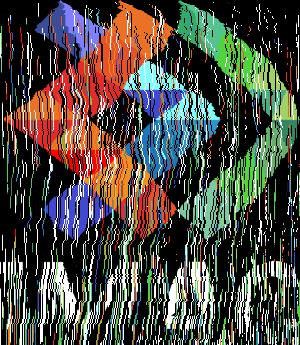
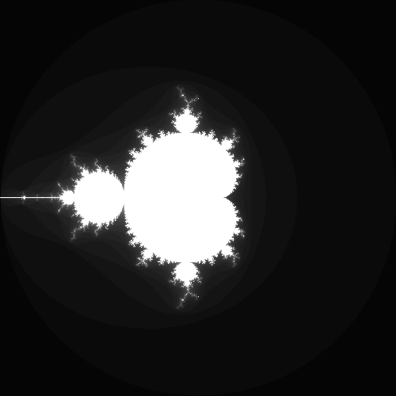

##Ne garder que le vert

##Échanger les canaux

##Noir & Blanc

##Négatif

##Dégradé

Le calcul a pris un peu de temps à être trouvé, mais c'est :
'''cpp
float color = static_cast<float>(i) /(image.width()-1);
image.pixel(i, y) += color;
'''

##Miroir

Nous avons eu deux façon de faire :
'''cpp
std::swap(image.pixel(i, y), image.pixel(image.width()-1-i, y));
'''
ou avec une fonction MiroirV2
'''cpp
int miroir = image.width()-x;
imageInverse.pixel(miroir, y) = image.pixel(x, y);
'''

##Image bruitée

Pour cet effet là, nous avons fait en sorte d'avoir des coordonnées de pixels random, et ensuite nous avons fait de même pour chaque partie de la couleur du pixel en question.

##Rotation 90°

Nous avons créer une nouvelle image en inversant les valeur de width et de height. Puis nous avons recopier l'image à partir des bonnes coordonnées.

##RGB Split

Voir le code.

##Luminosité
Pour l'éclaircissement :

Pour l'assombrissement :

Pour les deux nous avons utilisé la fonction pow(), avec différentes valeurs de puissance.

##Disque

Dans le if pour colorer les bon pixels, nous avons utilisé :
'''cpp
std::pow(i - image.width()/2, 2) + std::pow(j - image.height()/2, 2) <= std::pow(100, 2);
'''

##Cercle

Nous avons utilisé deux fois le même if que pour le disque, juste avec des valeurs différentes.

##Rosace

Nous avons recréer une fonction dessine_cercle, que l'on a appeler plusieurs fois, pour dessiner les different cercles de la rosace.

##Mosaïque

##Mosaïque miroir

##Glitch

##Fractale de Mandelbrot

##Vortex
##Tramage
##Normalisation de l'histogramme
##Convolution (et essais de netteté)
##Tri de pixels